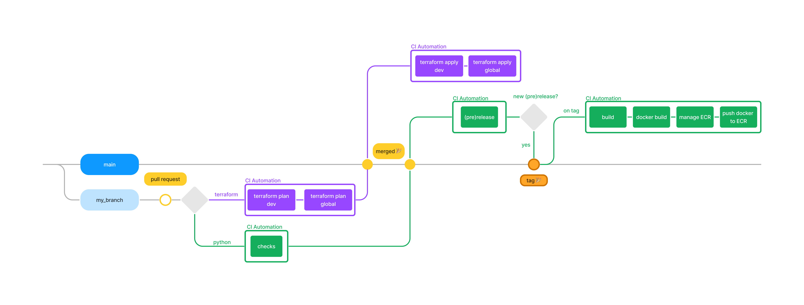

## CI/CD workflows

*Fig 1: CI workflow for tag-generator project*

Here I describe the CICD flow of the project.

We have two flows:
- the purple flow which corresponds to terraform deployment workflow. It is our AWS resource creation workflow
- the green flow which correspond to python checks (linter, formatter, unit tests and coverage) and then release

## Terraform flow
It is triggered only:
- on merge request **AND**
- if there are changes on the [terraform/](../../iac/terraform/) folder

I use PR to controll the general flow, in order to avoid to trigger the runner too often.
In the PR, a terraform plan is performed and on PR merge, the terraform apply is perfom.

I choose to structure my project into environment.
- `dev`: for resources, I would like to create in dev, just for testing
- `prod`: for prod resources
- `global`: for resources that are not seperate into `dev` or `prod`. For instance the user creation is `global`, there are no `dev/prod` user (even though that could be possible, I choose not to do for such a simple project)

So in the PR, I do the apply for `dev` and `global` (and eventually `prod`) and on PR merge, I do the apply for `dev` and `global`.

## Python flow

It is triggered only:
- on pull request **AND**
- if there are changes on the python packages folder

I use PR to controll the general flow as stated in the previous flow.

The first thing that is perform is [checks.yaml](./checks.yaml):
- lint and formating
- unit tests
- test coverage: if the coverage changes, a new coverage badge will be add to [reports](../../reports/coverage.svg)

When that stage passes, and the PR is merged, another step is trigger (still inside [checks.yaml](./checks.yaml)):
- semantic-release: its goal is to detect what the next version of the project should be based on the commits

If there is a new version, semantic-release will tag the project, change version number in `pyproject.toml`, create changelog. On tag, another CI pipeline will be triggered using [tag.yaml](./tag.yaml). It will:
- build the different python packages
- build a docker image
- push the image to ECR on AWS