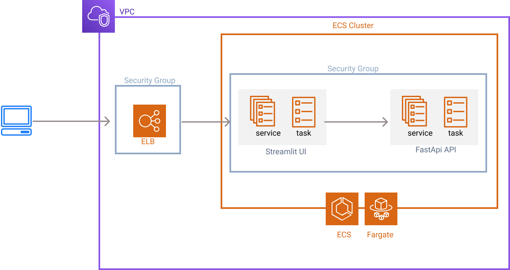

# Infra as code with Terraform

## The ECS Architecture

*Fig1: The ECS architecture used for deploying the UI et the API*

## The Iam Identity Connect setup
*Fig1: The Iam Identity Connect setup*

[credentials precendents](https://docs.aws.amazon.com/cli/latest/userguide/cli-chap-configure.html#configure-precedence)

## Others resources

## Working with terraform
### install
- terraform cli
- tflint
